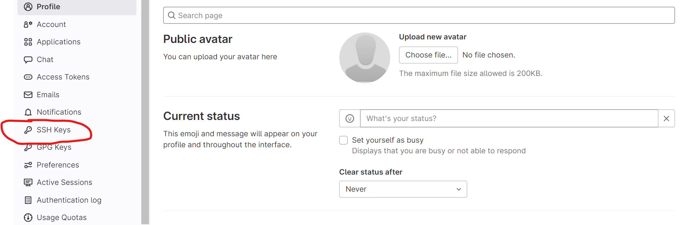
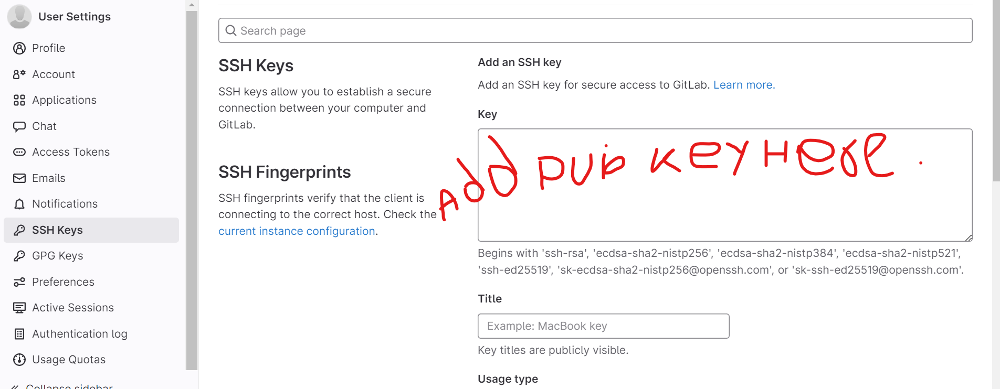
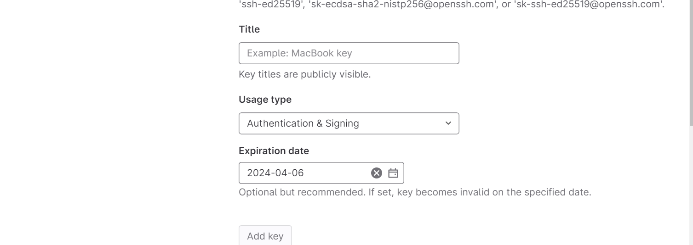

## How to setup the ssh key in gitlab.cern.ch
1. Login to lxplus
2. Generate ssh-key pair following the instructions at the [link](https://docs.gitlab.com/ee/user/ssh.html#generate-an-ssh-key-pair)
3. Go to gitlab.cern.ch and then to your profile Or click on the [link](https://gitlab.cern.ch/-/profile/)
4. Click on "SSH Keys" in your profile on the left panel. 
5. Add public key (something like id_ed25519.pub) from your lxplus account (present in the `~/.ssh/` directory). 
6. Fill up the details 
  - `Title` could be anything that you like.
  - keep `Usage Type` Authentication and Signing.
  - Choose any `Expiration Date`.
  - Finally click on `Add Key`.
### You are Done with setting up ssh key.
  
